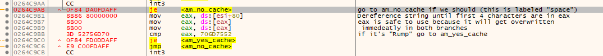
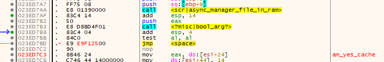

Information collected using x32dbg: https://x64dbg.com/

For levelhead v1.22.4-rc.7 \
Changes the first `je`/branch after the call to the script `async_manager_file_in_ram` in the script `async_manager_load`: \
Jumps to a inserted subroutine (located in empty space above `scr|struct_122|rumpus_perk_progress_clear`):
- If the file wasn't cached, go to that branch
- Otherwise check if the path begins with "Rump":
	- If so: go to branch for if it was cached
	- Otherwise go to the branch if it wasn't cached

This makes it so only files with a path staring with "Rump"(us) are cached if (those aren't, playing user levels crashes the game for some reason). Any other files will always be reloaded.

The code references strings containing the names of script/object events at the start of their respective code block, which allows us to identify scripts.
The actual script starts at the `push ebp` (before the string reference) right after the `int3`.

Recreating the patch (in other versions of Levelhead):
1. Find an empty spot somewhere
	- I suggest looking for a pile of `CC`, which are the `int3` instructions between subroutines
1. Find where `async_manager_load` starts
2. Find out where `async_manager_file_in_ram` starts
3. Find the references to that address (e.g. where it gets called)
4. Go to the one as soonest after the start of `async_manager_load`
5. Jump to the subroutine space found in step 1
6. Recreate the subroutine from the first screenshot
	- `am_yes_cache` is the instruction immediately after the `je`
	- `am_no_cache` is what that `je` jumped to
	- You can leave the `ds:` out of `ds:[eax]`
	- The numbers are hexadecimal, you probably have to prepend `0x` when assembling
